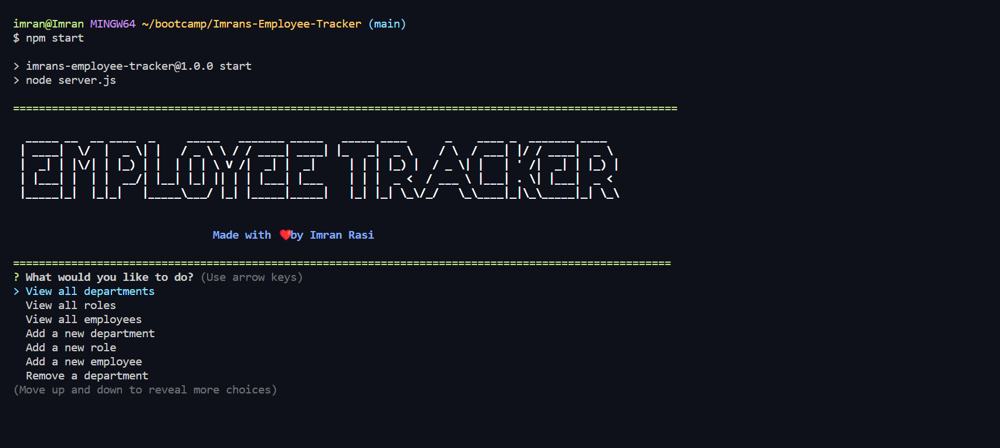
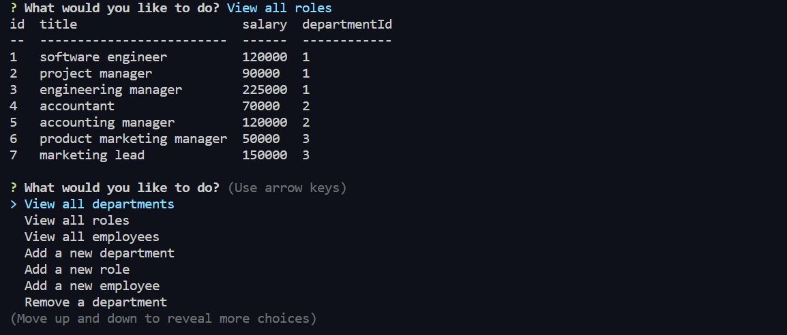
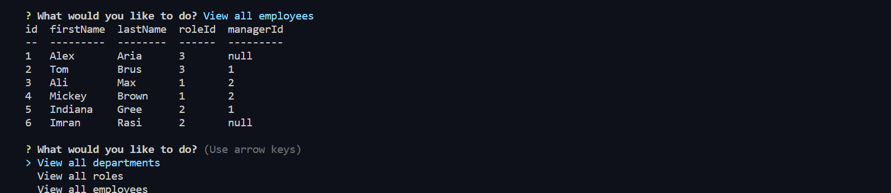

# Imrans-Employee-Tracker

## Description

This command line application manages a company's employees using Node, Inquirer, and MySQL. This assignment I created an interfaces that make it easy for bussiness owner to view and interact with information stored in databases. by using node, inquirer, and MySQL.

## Table of Contents
* [Installation](#installation)
* [Video Walk Through](#videowalkthrough)
* [Usage](#usage)
* [License](#license)
* [Credits](#credits)
* [Questions](#questions)

## Installation

1. Clone the repository.
2. Run "npm i"
3. Run "npm install inquirer"
4. Run "npm install mysql"
5. Run "npm install console.table"

## Video Walk Through

* You also can go through that link for a better look <a href="https://drive.google.com/file/d/18CXQK_wt8MYeQy-ywYhgmOGpMV1iC9-h/view">Video</a>
## Usage 

1. Clone the repo.
2. type "npm i" to install the necessary packages.
3. then run "node server.js"
4. Or "npm run"

## License

[MIT License](./LICENSE)

## Credits

* <a href="https://nodejs.org/">Node.js</a>
* <a href="https://www.npmjs.com/">NPM</a>
* <a href="https://www.npmjs.com/package/inquirer">Inquirer.js</a>

## Questions

If you have any Questions :
  * Email : imran.rassi.2020@gmail.com
  * GitHub: [imran7rassi](https://github.com/imran7rassi)